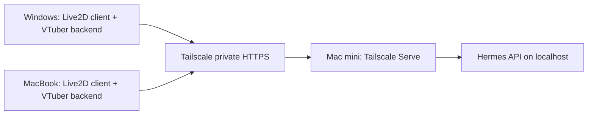

# Bring Your Hermes Alive

Give your Hermes Agent a Live2D desktop companion — at home or on the go.

[中文指南](README.zh-CN.md) · [Mac mini setup](docs/mac-mini.md) · [Desktop setup](docs/desktop.md) · [Codex handoffs](docs/codex-handoffs.md)

**Status: early deployment starter kit, not a one-click desktop application.**
The included Python utilities have offline tests. Real Hermes, Tailscale, voice,
and Live2D integration still require hardware validation. No rigged character is bundled.

## Architecture



- **Mac mini:** existing Hermes installation, its Gateway/API, Tailscale Serve.
- **Windows / MacBook:** Tailscale, Open-LLM-VTuber backend and Electron client.
- Speech recognition and synthesis belong to each desktop's VTuber backend.
- Hermes executes tools on its host; this does not grant Windows desktop control.
- Separate clients initially keep separate conversation histories. Cross-device continuation is future work.

## Start here

1. Clone your fork and install Python 3.10+ for this project's utilities. No pip dependencies.
2. Follow [Mac mini setup](docs/mac-mini.md), preserving the existing Hermes profile.
3. Follow [desktop setup](docs/desktop.md), first with an upstream licensed example model.
4. Run the API checks below, then complete the [acceptance checklist](docs/validation.md).
5. Replace the example character using the [Live2D guide](docs/live2d.md).

```bash
python tools/doctor.py --base-url https://YOUR-HOST.YOUR-TAILNET.ts.net/v1
```

The tool prompts for the API key without echoing it, or reads `HERMES_API_KEY`.
It only lists models by default. Add `--chat` for one billable inference request;
add `--stream` for a separate streaming request. Use `--model ACTUAL_MODEL_ID`
if the endpoint advertises multiple models. Responses and credentials are not printed.

Generate a new, local-only Hermes environment snippet:

```bash
python tools/init_env.py --output .local/hermes-api.env
```

This never edits your Hermes installation. Merge the snippet into the **actual active
profile** after backing up its configuration. Never commit the generated file.

## Scope

Included: deployment instructions, safe configuration examples, API diagnostics,
offline tests, and copyable Codex task briefs. Not included: upstream applications,
model weights, Live2D SDK/assets, paid voice accounts, remote-control tools, or a
custom compatibility proxy. Build a proxy only after documenting an actual mismatch.

## Development

```bash
python -m unittest discover -s tests -v
```

See [CONTRIBUTING.md](CONTRIBUTING.md), [SECURITY.md](SECURITY.md), and
[roadmap](docs/roadmap.md). Contributions must distinguish mock tests from real-device results.

## Upstream projects

- [Hermes Agent](https://github.com/NousResearch/hermes-agent) — agent runtime.
- [Hermes API documentation](https://hermes-agent.nousresearch.com/docs/user-guide/features/api-server/) — API contract.
- [Open-LLM-VTuber](https://github.com/Open-LLM-VTuber/Open-LLM-VTuber) — voice and Live2D frontend.
- [VTuber setup](https://docs.llmvtuber.com/en/docs/quick-start/) and [configuration](https://docs.llmvtuber.com/en/docs/faq/).
- [Tailscale Serve](https://tailscale.com/docs/features/tailscale-serve) — private service publishing.

Independent community project; not affiliated with the upstream maintainers.
Original code and documentation: MIT. Third-party applications, SDKs, voices and
character assets retain their own licenses; none are relicensed by this repository.
